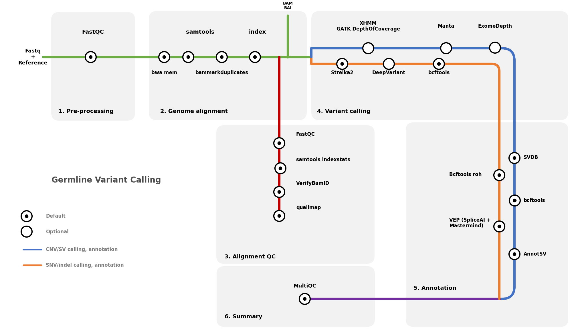

# germline-nextflow

A modular **Nextflow DSL2** pipeline for **germline variant analysis** (WES/WGS), supporting SNV/indel and CNV/SV workflows with optional cohort-level CNV modules.

---

## Overview

This pipeline performs:

- FASTQ processing and alignment
- lane-level to sample-level BAM consolidation
- duplicate marking and indexing
- alignment QC
- SNV/indel calling
- SV/CNV calling
- cohort CNV analysis (XHMM / ExomeDepth)
- summary reporting (MultiQC)

It is designed for both **local** and **HPC** execution using containers (Docker/Singularity).

---

## Workflow



<!-- <p align="center">
  
</p> -->

---

## Main pipeline stages

1. **Pre-processing**
   - FastQC

2. **Genome alignment**
   - `bwa mem`
   - Add/replace read groups
   - lane merge (per sample)
   - duplicate marking (`biobambam2`)
   - `samtools index`

3. **Alignment QC**
   - FastQC
   - `samtools idxstats`
   - VerifyBamID2
   - Qualimap

4. **Variant calling**
   - SNV/indel branch: Strelka2, optional DeepVariant, optional bcftools normalization/merge
   - CNV/SV branch: Manta, GATK DepthOfCoverage + XHMM
   - Optional ExomeDepth cohort CNV step

5. **Annotation**
   - Optional downstream annotation modules (e.g., bcftools/VEP/AnnotSV integration)

6. **Summary**
   - MultiQC


---

## Requirements

* Nextflow (DSL2-compatible)
* Java 17+ (or as required by your Nextflow version)
* One of:

  * Docker
  * Singularity / Apptainer
* Reference data configured in `conf/igenomes.config` 

---

## Input format

### Samplesheet (`--input`)

```csv
patient,sample,lane,fastq_1,fastq_2
NA12878,NA12878,lane1,/data/NA12878_L001_R1.fastq.gz,/data/NA12878_L001_R2.fastq.gz
NA12878,NA12878,lane2,/data/NA12878_L002_R1.fastq.gz,/data/NA12878_L002_R2.fastq.gz
NA12891,NA12891,lane1,/data/NA12891_L001_R1.fastq.gz,/data/NA12891_L001_R2.fastq.gz
```

* Multiple rows per `sample` are merged after alignment.
* `lane` must uniquely identify sequencing lanes/libraries per sample.

---

## Quick start

### Local test run (Singularity profile)

```bash
nextflow run main.nf -profile singularity \
  --input samplesheet.csv \
  --genome GATK.GRCh38 \
  --outdir results
```

### Typical WES run with target BEDs

```bash
TARGET_BED="/path/to/Twist_WES_targets.bed"

nextflow run main.nf -profile singularity -resume \
  --input samplesheet.csv \
  --genome GATK.GRCh38 \
  --coverage_target_bed  "${TARGET_BED}" \
  --xhmm_intervals_bed   "${TARGET_BED}" \
  --qualimap_feature_bed "${TARGET_BED}" \
  --variant_target_bed   "${TARGET_BED}" \
  --outdir results
```

---


## Output structure (not yet)

```text
results/
├── alignment/
├── qc/
│   ├── fastqc/
│   ├── idxstats/
│   ├── verifybamid2/
│   └── qualimap/
├── variants/
│   ├── strelka/
│   ├── deepvariant/
│   ├── manta/
│   └── bcftools/
├── cnv/
│   ├── xhmm/
│   └── exomedepth/
└── multiqc/
```


---

## Reproducibility and restart

* Use `-resume` to continue failed/interrupted runs.
* Pin container images and pipeline revision for stable reruns.
* Keep reference files and BED files versioned in your project metadata.

